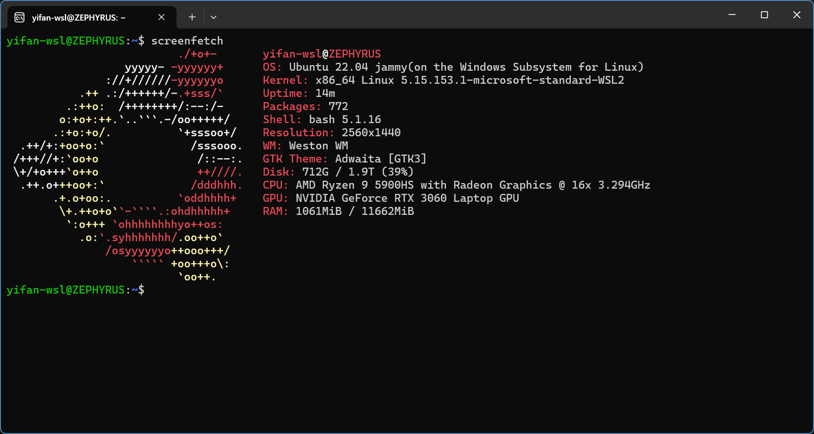
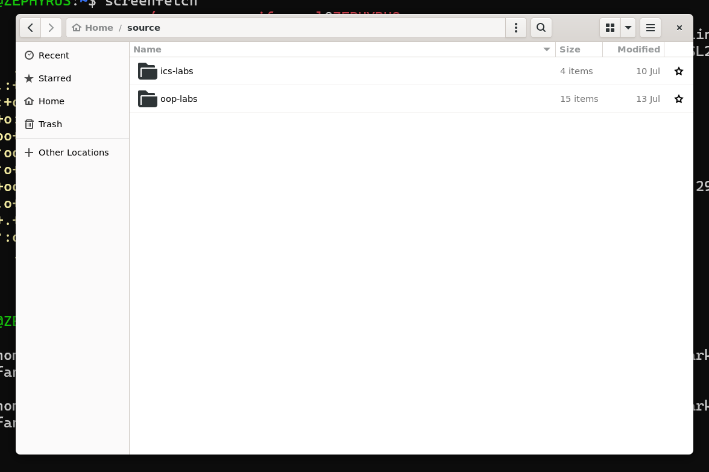
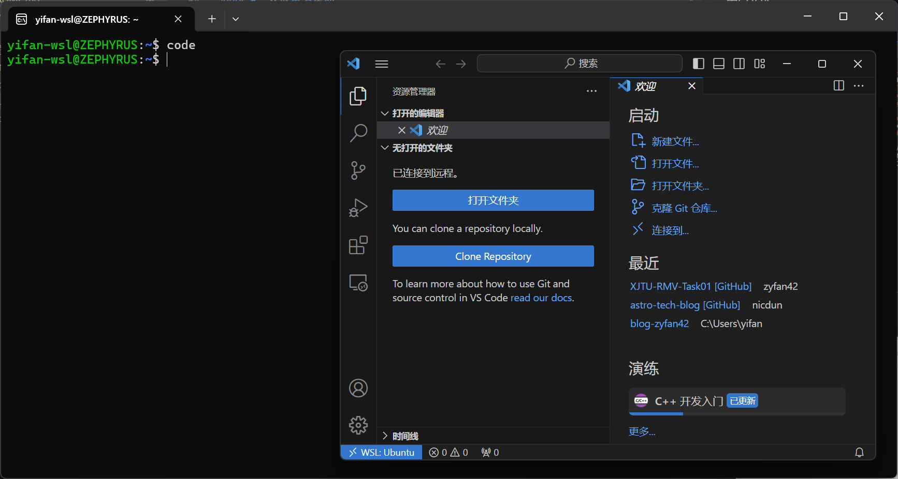
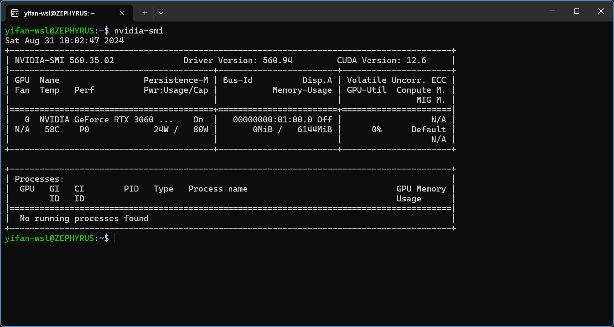

# Task01
*由于频繁使用WSL，选择了最快的安装方式。*

参考微软官方的[最佳安装实践](https://learn.microsoft.com/zh-cn/windows/wsl/setup/environment)可以优雅地安装Linux子系统，其中的[Troubleshooting](https://learn.microsoft.com/zh-cn/windows/wsl/troubleshooting)也能解决大部分常见问题。

现将WSL安装过程总结如下：

### WSL 安装指南

#### 1. 启用必要功能
1. 打开 **PowerShell**（以管理员身份运行）。
2. 输入以下命令并回车，启用 WSL 和虚拟机平台功能：
    ```powershell
    dism.exe /online /enable-feature /featurename:Microsoft-Windows-Subsystem-Linux /all /norestart
    dism.exe /online /enable-feature /featurename:VirtualMachinePlatform /all /norestart
    ```
3. 如果使用 WSL 2，还需启用 **Hyper-V** 功能：
    ```powershell
    dism.exe /online /enable-feature /featurename:Microsoft-Hyper-V-All /all /norestart
    ```
4. 重启电脑。

#### 2. 安装 WSL
1. 在 **PowerShell** 中输入以下命令并回车：
    ```powershell
    wsl --install
    ```
2. 系统会自动安装 WSL 2 及所需的 Linux 内核组件。

#### 3. 安装 Linux 发行版
1. 重启后，打开 **Microsoft Store**。
2. 搜索并安装你喜欢的 Linux 发行版（如 Ubuntu）。

#### 4. 设置并启动 WSL
1. 安装完成后，打开你安装的 Linux 发行版。
2. 根据提示设置用户名和密码。
3. WSL 环境现在已经可以使用。

#### 5. 检查 WSL 版本
1. 在 **PowerShell** 中输入以下命令来查看当前 WSL 版本：
    ```powershell
    wsl --list --verbose
    ```

#### 6. 更新 WSL 内核
1. 在 **PowerShell** 中输入以下命令来更新 WSL 内核：
    ```powershell
    wsl --update
    ```

#### 7. 更改 WSL 版本（可选）
1. 默认情况下，WSL 安装的是 WSL 2。如果需要切换到 WSL 1，输入以下命令：
    ```powershell
    wsl --set-version <发行版名称> 1
    ```
    替换 `<发行版名称>` 为你的实际发行版名称。

#### 8. 卸载 WSL（可选）
1. 如需卸载 WSL，可以在 **PowerShell** 中输入以下命令：
    ```powershell
    wsl --uninstall
    ```

#### 9. 获取更多帮助
1. 输入以下命令查看完整的 WSL 命令帮助：
    ```powershell
    wsl --help
    ```

以上步骤即可安装一个**够用**的WSL 2，参考[WSL 文档](https://learn.microsoft.com/zh-cn/windows/wsl/)还可以尝试运行GUI应用或使用CUDA。

以下是我使用WSL的一些截图：

*系统内核*


*Nautilus文件管理器*


*连接到VS Code*


*检查Nvidia GPU驱动*